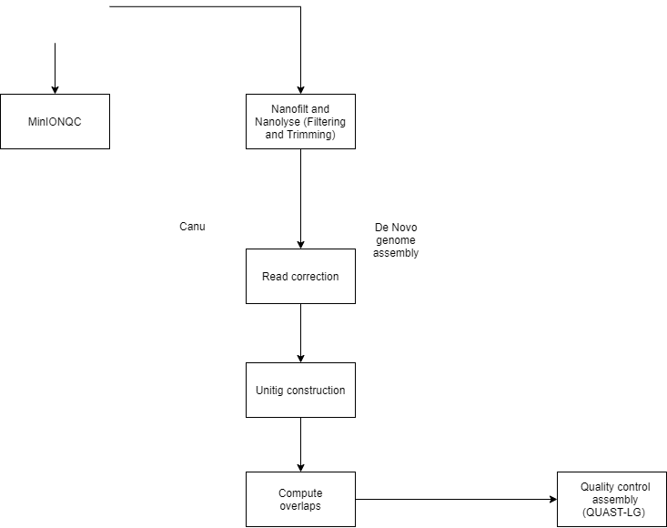

# Project-16
Quality control on the personal-identification-pipeline created by Zaaijer et al. using minION sequenced HeLa CaSki cell lines.
## Table of contents
- Requirements
- Brief description

## Requirements
* Linux 
* Python 3.7 
* Java

## Brief description
Quality control on the personal-identification-pipeline created by Zaaijer et al. using minION sequenced HeLa CaSki cell lines.

Zaaijer et al. build a pipeline personal-identification-pipeline to quickly determine cancer types in cell lines. This pipeline implements the minION sketching method which identifies cell lines based on the present SNP's present in short, raw minION reads. The paper about this study is stated below:

> https://www.ncbi.nlm.nih.gov/pmc/articles/PMC5705215/

To control this the personal-identification-pipeline, a pipeline was build, using minION sequenced HeLa CaSki cell lines as data.
The flow chart of all programs and steps of this pipeline is depicted below.

## MinIONQC
Quality assessment of the raw minION reads was performed by minIONQC.Full documentation on the minIONQC tool can be found using the link below:
> https://github.com/roblanf/minion_qc

Uses a summary.txt of the minION sequencing as input in this case `MT-110490_20191217_144542_FAL19003_minion_sequencing_run_20191217_helacaski-LL_bc01-02_sequencing_summary.txt`.

## Nanofilt
Reads were trimmed using NanoFilt. Reads were filtered based on a quality of 9, which is also implemented in the personal-identification pipeline. After installing, the tool works with a simple command: NanoFilt -q 9 reads.fastq > trimmed.fastq  

Full documentation on NanoFilt is given in the link below:
> https://github.com/wdecoster/nanofilt

Reads were filtered in lisa using the batch script `nanofilt.sh`

## Canu
Assembly was attempted by Canu, a de novo assembler. Full documentation on Canu can be found on both github and official documentation, both are stated below. The tool is used on the grid of lisa.

> https://canu.readthedocs.io/en/latest/
> https://github.com/marbl/canu

Assembly with canu can be attempted through multiple paths, by conda, pre2019 biorunner and the binary release, which is advised to use. Using conda for running canu enables the use of the latest version of the tool. For this instance, version 2.0. While running Canu using the HeLa CaSki minION reads, data provided by canu was also used to detect possible errors. E.coli sequenced by minION was used as data, along with the command stated in the Canu tutorial. The scripts and slurms show a mhap precompute job failed. According to Canu documentation this error is due to conda installation errors. As Canu runs on lisa, a Canu version provided by the server through pre2019 biorunner. Due to the Canu of pre2019 biorunner, it is not able to run Canu on the grid, as can be seen in the slurms of the scripts. 

Ultimately, the genome was assembled by Canu present on galaxy.eu. The trimmed reads were indicated as raw nanopore data, this was the only changed setting.
