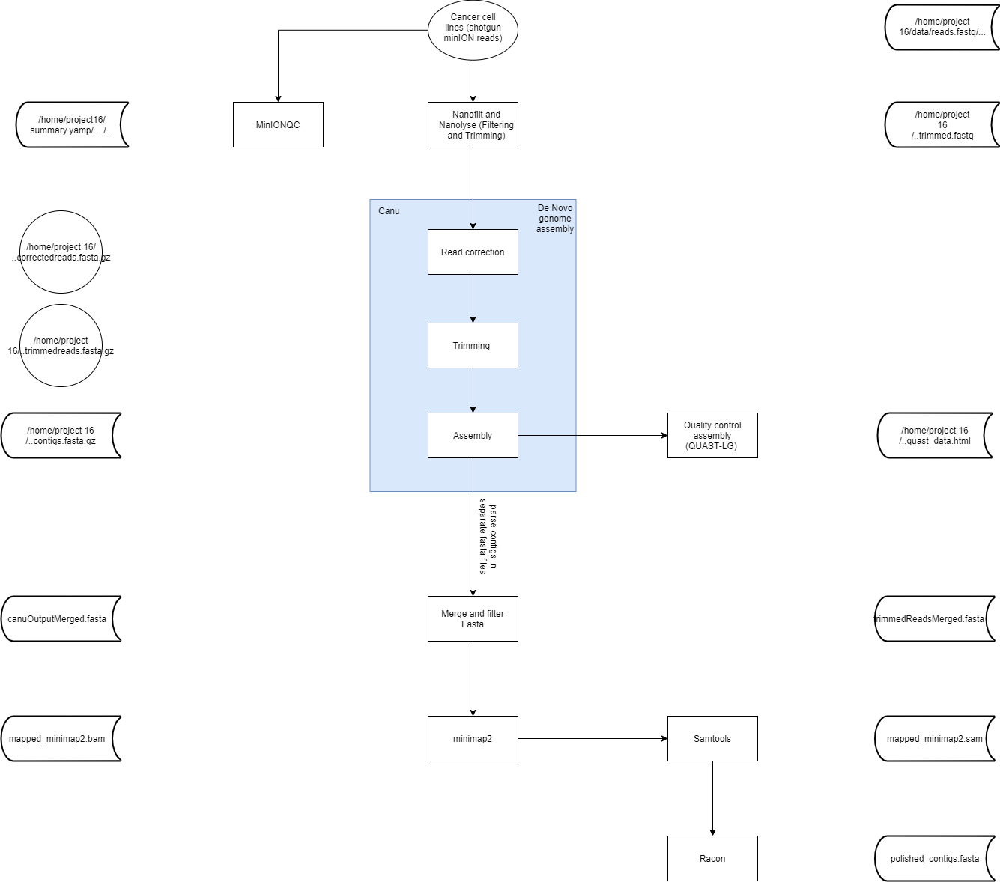

# Project-16
Quality control on the personal-identification-pipeline created by Zaaijer et al. using minION sequenced HeLa CaSki cell lines.
## Table of contents
- Requirements
- Brief description
- MinIONQC
- Nanofilt
- Canu 
- QUAST

## Requirements
* Linux 
* Python 3.7 
* Java
* Canu binary release

## Brief description
Quality control on the personal-identification-pipeline created by Zaaijer et al. using minION sequenced HeLa CaSki cell lines.

Zaaijer et al. build a pipeline personal-identification-pipeline to quickly determine cancer types in cell lines. This pipeline implements the minION sketching method which identifies cell lines based on the present SNP's present in short, raw minION reads. The paper about this study is stated below:

> https://www.ncbi.nlm.nih.gov/pmc/articles/PMC5705215/

To control this the personal-identification-pipeline, a pipeline was build, using minION sequenced HeLa CaSki cell lines as data.
The flow chart of all programs and steps of this pipeline is depicted below.



## MinIONQC
Quality assessment of the raw minION reads was performed by minIONQC.Full documentation on the minIONQC tool can be found using the link below:
> https://github.com/roblanf/minion_qc

Uses a summary.txt of the minION sequencing as input in this case `MT-110490_20191217_144542_FAL19003_minion_sequencing_run_20191217_helacaski-LL_bc01-02_sequencing_summary.txt`.

## Nanofilt
Reads were trimmed using NanoFilt. Reads were filtered based on a quality of 9, which is also implemented in the personal-identification pipeline. After installing, the tool works with a simple command: NanoFilt -q 9 reads.fastq > trimmed.fastq  

Full documentation on NanoFilt is given in the link below:
> https://github.com/wdecoster/nanofilt

Reads were filtered in lisa using the batch script `nanofilt.sh`

## Canu
Assembly was attempted by Canu, a de novo assembler. Full documentation on Canu can be found on both github and official documentation, both are stated below. The tool is used on the grid of lisa. Input for canu are the trimmed minION reads in fastQ format.

> https://canu.readthedocs.io/en/latest/
> https://github.com/marbl/canu

Assembly with canu can be attempted through multiple paths, by conda, pre2019 biorunner and the binary release,the latter is advised to use by canu. Script used to run canu is

Using conda for running canu enables the use of the latest version of the tool. For this instance, version 2.0. Both the data provided in the tutorial of conda, as wel as the trimmed HeLa CaSki cell line were used as input. The scripts and slurms are..

As Canu runs on lisa, a Canu version provided by the server through pre2019 biorunner. This version of canu has been run both locally and on the grid. Scripts and slurms are provided in..

Ultimately, the genome was assembled by Canu present on galaxy.eu. The following settings were used:
```
Input files                                                                    Trimmed minION reads in fastQ format
Mode                                                                           Nanopore-raw
To restrict canu to only a specific stage, use                                 All
Estimated genome size                                                          3000m
Maximum raw overlap mismatch                                                   0.500
Maximum corrected overlap mismatch                                             0.144
Minimum read length                                                            1000
Minimum overlap                                                                500
Target coverage for corrected reads                                            40
```
## QUAST
QUAST is 
